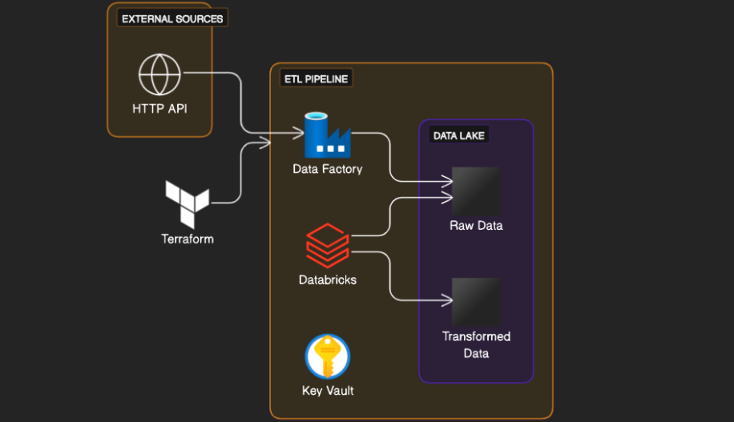

# Azure Data Pipeline Architecture

The following diagram illustrates the architecture of our data pipeline:

## Architecture Overview

- **External Sources**: Data is ingested from various external sources through HTTP APIs.
- **Terraform**: Utilizes Infrastructure as Code (IaC) to provision and manage cloud resources, including Key Vault, Data Factory, and the Data Lake.
- **ETL Pipeline**: The Extract, Transform, Load (ETL) processes are orchestrated using:
  - **Data Factory**: Azure's cloud-based data integration service. Data Factory is set up to copy files from HTTP sources, such as the CSV file available at `https://data.wa.gov/api/views/f6w7-q2d2/rows.csv?accessType=DOWNLOAD`, which contains details on the electric vehicle population such as VIN, County, City, Model Year, Make, Model, Type of Electric Vehicle, and more.
  - **Databricks**: A unified data analytics platform. Once data is copied into the `raw-data` container in the Data Lake, Databricks reads it, performs transformations, calculates metrics, and copies the transformed data into the `transformed` folder within the Data Lake in Parquet format.
  - **Key Vault**: Azure service to securely manage secrets and keys.
- **Data Lake**: Serves as the central repository for both raw and transformed data, designed for big data analytics. The electric vehicle data, once processed, are stored efficiently for further analysis and querying.
